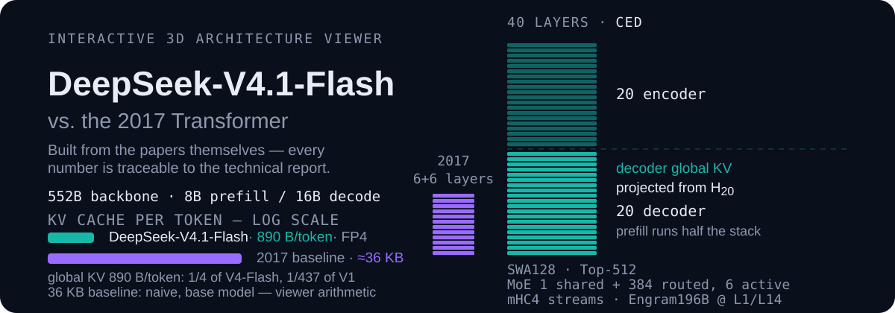
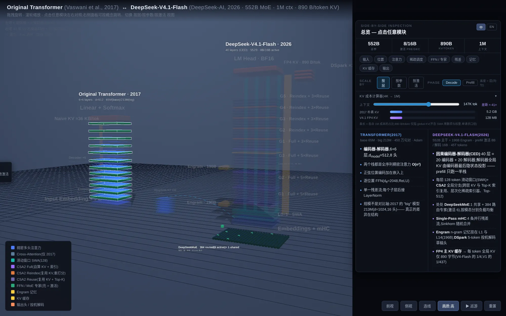

<p align="center">
  
</p>

# DeepSeek-V4.1-Flash vs. the original Transformer — interactive 3D architecture viewer

An interactive, zoomable 3D comparison of two architectures: the **2017 Transformer**
(Vaswani et al., *Attention Is All You Need*) and **DeepSeek-V4.1-Flash**
(DeepSeek-AI, 2026-09-10, *Pushing the Limits of KV Cache Compression*).

Built from the papers themselves — every number in the viewer is traceable to the
technical report (section references are shown in the hover tooltips).



---

## What it shows

| | Transformer (2017) | DeepSeek-V4.1-Flash (2026) |
|---|---|---|
| Topology | 6 + 6 encoder/decoder, cross-attention | 20 + 20 **CED** (causal encoder–decoder): decoder global KV is projected from H₂₀, so prefill runs half the stack |
| Attention | dense O(n²), 8 heads | 128-token **SWA** in every layer + **CSA2** global branch (cross-layer KV/index reuse, hierarchical sparse indexer, Top-512) |
| Feed-forward | d_ff = 2048 ReLU MLP | **DeepSeekMoE** in every block: 1 shared + 384 routed experts, 6 active |
| Residual | one stream, LayerNorm | **Single-Pass mHC**: 4 parallel streams, Sinkhorn-stochastic combine |
| Memory | — | **Engram** n-gram hash tables at layers 1 and 14 (196 B params) |
| KV cache | not addressed (≈36 KB/token naive, base model) | **890 B/token** global KV in FP4 (1/4 of V4-Flash, 1/437 of V1) |
| Output | softmax, one token per pass | **DSpark**: 3-block drafter, 5-token semi-autoregressive drafts, confidence-scheduled verification |

## Features

**Read the structure**
- Two towers side by side; drag to orbit, scroll to zoom, click anything to inspect it
- **Reuse brackets** on the right tower show which layers share KV (1 Full + N Reuse per group)
- **Green strip on every block** = MoE lives in every backbone layer (the cube field on the floor is the same 384 experts, magnified)
- Side modules are drawn outside the backbone: ViT (image path, with a flow wire into the embedding), Engram (memory, with write wires), DSpark

**Understand the mechanism**
- **Click any backbone layer** → the panel switches to a per-layer dataflow cross-section: what is *computed*, what is *reused*, what is *written to cache* (colour-coded badges, tensor shapes, § references)
- **▶ Walk (or press `W`)** → follow one token through all 40 layers, one station at a time, with a caption describing each step
- **Phase toggle (Prefill / Decode)** → prefill dims the decoder's global-attention layers, matching the CED claim
- **KV cost slider (4K → 1M)** → per-token cache cost for both architectures, with the ≈41× gap called out

**Compare**
- Concept chips (input, positional, attention, sparse schedule, FFN/experts, residual, memory, KV cache, output) → side-by-side fact columns, fully bilingual (中文 / EN)
- Keyboard: `↑↓` walk elements, `Esc` clear, `W` token walkthrough, `Space` demo tour
- Scale modes: **by layer / by parameters / by activation** — heights morph (staggered, bottom-up) to show where the parameters and the decode-time cost actually live
- `画质:高/低` (HQ/LQ) toggle for weak GPUs (bloom + shadows + supersampling)

## Run it

```bash
python3 serve.py 8741      # http://localhost:8741
```

`serve.py` is a small static server that sends `Cache-Control: no-store` for text
assets — plain `python -m http.server` lets browsers serve a stale `index.html`,
which makes iteration confusing.

Any static host works (the page has no build step). three.js is vendored locally, so
the viewer also works offline.

## Layout

```
index.html                 the whole app (markup, styles, scene, data)
serve.py                   no-cache static server
three.module.js            three.js r160 (MIT) — vendored
OrbitControls.js           three.js example (MIT)
RoundedBoxGeometry.js      three.js example (MIT)
postprocessing/            EffectComposer, RenderPass, UnrealBloomPass… (MIT)
shaders/                   CopyShader, LuminosityHighPassShader (MIT)
docs/                      screenshots
```

## Sources

- Vaswani et al., *Attention Is All You Need*, 2017 — baseline tower
- DeepSeek-AI, *DeepSeek-V4.1-Flash: Pushing the Limits of KV Cache Compression*,
  2026-09-10 (51 pp.) — right tower; the paper has no arXiv record, the official PDF
  ships with the model release:
  <https://huggingface.co/deepseek-ai/DeepSeek-V4.1-Flash/resolve/main/DeepSeek_V41_Tech_Report.pdf>
  (verified cell-by-cell against the extracted report text on 2026-09-11)
- three.js r160, MIT — rendering, controls, post-processing (vendored)

## Caveats

- Parameter counts for the **by parameters / by activation** scale modes are
  documented approximations derived from the component totals the report does give;
  they are annotated as approximations in the UI.
- The 2017 tower is drawn at the paper's base configuration (65 M, d=512); the
  "big" variant (213 M, d=1024) is noted in the tower subtitle.
- Re-verified cell-by-cell against the technical report on 2026-09-11. The report
  does not publish four specifics an earlier revision of the viewer asserted —
  the RoPE theta of the compressed main KV, YaRN-style context extension, the
  DSpark drafter's expert configuration, and the LM head's precision. Those were
  removed rather than guessed; the numbers that stayed (window 128, Top-512,
  mHC expansion 4 with 20 Sinkhorn-Knopp iterations, indexer 32×128, 64 query
  heads × head dim 512, Engram at layers 1/14) are quoted from the report's model
  setup. The 36 KB/token baseline and the ≈41× gap are the viewer's own
  arithmetic and are labelled as such in the UI.
- The viewer keeps a few `window.__*` hooks used for layout/collision verification
  during development.

<p align="center">
  <a href="https://github.com/oil-oil/beautify-github-readme"></a>
</p>

## License

MIT — see [LICENSE](LICENSE). Vendored three.js files remain under their own MIT
license (Copyright 2010-2023 three.js authors).
